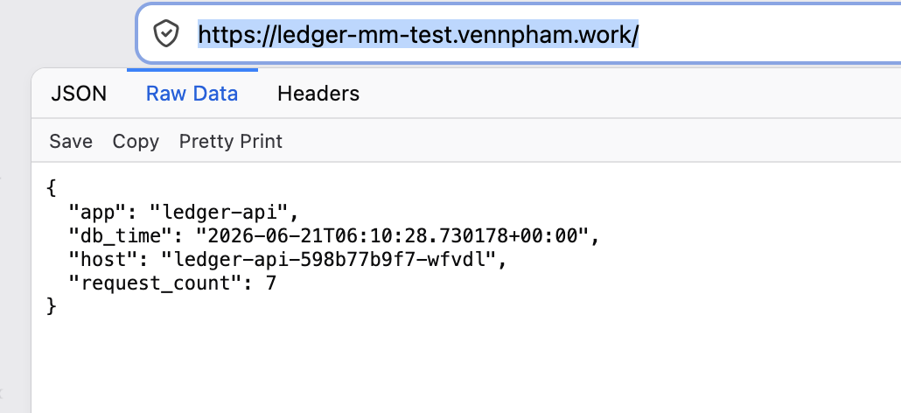

# Key Decisions and Tradeoffs

This document outlines the design choices, tradeoffs, and production-grade recommendations made during this take-home exercise.

---

## 1. Task 1: Package the App (Docker)
- **Base Image Selection**: Changed from `python:latest` (which pulls a large Debian image with build tools, making the image size ~1GB and increasing vulnerability surface area) to `python:3.11-slim-bookworm` (Debian slim). Pinned to a specific minor version for reproducibility.
- **Multi-Stage Build**: Separated the build environment (compilation/pip download) from the final runtime image. The builder stage installs compilers like `gcc` and `build-essential` to fetch requirements, while the runtime stage only copies the pre-packaged python virtualenv. This keeps the final image lightweight (~180MB) and secure.
- **Layer Caching**: Copied `app/requirements.txt` first and ran `pip install` before copying the rest of the application files. This ensures that changes to application code do not invalidate the pip installation layer, speeding up development and CI builds.
- **Security (Non-Root User)**: Configured the final container to run under a non-privileged system user (`appuser`, UID 10001) instead of `root`. This adheres to the principle of least privilege, preventing container breakout attacks.
- **WSGI Server**: Wrapped the Flask application with `gunicorn` (using 4 worker processes and 2 threads) to run as a production-grade web server rather than Flask's single-threaded development server.

---

## 2. Task 2: Local Dev Stack (Docker Compose)
- **Local Dev Isolation**: Included dedicated `postgres:16-alpine` and `redis:7-alpine` containers for docker-compose testing to keep the local development stack fully self-contained and reproducible.
- **Database/Cache Connectivity**: Set `DATABASE_URL` and `REDIS_URL` in the application environment using Docker internal DNS names (`postgres` and `redis`) instead of hardcoding `localhost`.
- **Startup Order & Healthchecks**: Configured healthchecks in Postgres (`pg_isready`) and Redis (`redis-cli ping`) and updated the app's `depends_on` block with `condition: service_healthy`. This prevents the application container from booting (and crashing) before its database dependencies are ready.

---

## 3. Task 3: Kubernetes Manifests (Production-Minded)
- **External Cluster Rather**: Rather than using kind / minikube for reproduce the deployment testing, I have used my HomeLabs cluster for deploying the test application and expose the endpoint via Envoy Loadbalancer that is already configured for Production use case remediation and expose application endpoint to my IaC cloudflare tunnel. In a real-world scenario, you would set up kind or minikube, install an Ingress Controller (like ingress-nginx or Traefik), and configure the Ingress resource accordingly. This Ingress resource would route external HTTP/HTTPS traffic to the `ledger-api` service. The specific port (like 8000 in this case) would be mapped to the service's targetPort.

- **External Databases Integration**: Rather than deploying ephemeral database pods in-cluster, we configured the app to communicate with your external databases (`192.168.122.245` for Postgres and `192.168.122.203` for Redis) by utilizing Kubernetes `Service` and `Endpoints` resources.
  - *Why?* This abstracts the physical IP addresses into standard internal DNS records (`postgres` and `redis`), maintaining configuration parity between docker-compose and Kubernetes.
- **Zero-Downtime Deployments**: Utilized a `RollingUpdate` strategy with `maxSurge: 1` and `maxUnavailable: 0` combined with a `PodDisruptionBudget` (`minAvailable: 2`) to ensure that at least two app instances are running and ready at all times during updates.
- **Probes**: Configured active `/healthz` (liveness) and `/readyz` (readiness) HTTP probes on Gunicorn's port. The readiness probe prevents unhealthy traffic routing if database dependencies are disconnected.
- **Network Security**: Created a `NetworkPolicy` that restricts ingress to port `8000` and allows egress only to CoreDNS (`kube-dns` on port 53) and the database endpoints.

https://ledger-mm-test.vennpham.work/


---

## 4. Task 4: Infrastructure as Code (Terraform)
- **Native Providers**: Defined the Kubernetes components directly as native Terraform resources using the `kubernetes` provider. This keeps infrastructure declarative and allows Terraform to fully track state, detect drift, and handle updates natively.
- **Kubeconfig Authentication**: Configured the provider to authenticate via `/Users/vennpham/.kube/config`, aligning directly with your active cluster context.
- **Secrets Management with SOPS**: Configured database and cache connection strings as sensitive Terraform variables. To avoid hardcoding values or committing them to git, we use **Mozilla SOPS** (`getsops/sops`) to manage encrypted secrets in a `secrets.enc.tfvars` file:
  - *Locally*: Decrypt secrets directly into a git-ignored `.terraform.tfvars` file or use process substitution (`terraform apply -var-file=<(sops -d secrets.enc.tfvars)`) so plaintext credentials never persist on disk.
  - *GitHub Actions*: The encrypted `secrets.enc.tfvars` is safely committed to the repository. In the CI/CD pipeline, the decryption key (e.g., an `AGE` private key or AWS/GCP KMS role) is stored as a secure **GitHub Repository Secret**. The runner decrypts the variables on-the-fly inside memory, preventing raw credentials from leaking into run logs or repository histories.


---

## 5. Task 5: CI Pipeline
- **Static and Security Analysis**: Integrated `hadolint` to audit Dockerfile best practices and `trivy` to scan built images for security vulnerabilities.
- **Manifest Linting**: Configured `kubeconform` to parse Kubernetes manifests against standard OpenAPI schemas, ensuring syntax errors are caught in CI.
- **Terraform Validation**: Included format checking (`fmt -check`) and configuration checks (`validate`) to verify TF code without needing a live backend.

---

## 6. Debug a broken deployment
```log
│   Normal   Scheduled  65s                 default-scheduler  Successfully assigned default/broken-web-66967c45c5-wj72g to tl-worker-4-dev                                                                                                                          │
│   Normal   Pulled     45s (x2 over 62s)   kubelet            Container image "nginx:1.27-alpine" already present on machine                                                                                                                                        │
│   Normal   Created    45s (x2 over 62s)   kubelet            Created container web                                                                                                                                                                                 │
│   Normal   Killing    45s                 kubelet            Container web failed liveness probe, will be restarted                                                                                                                                                │
│   Normal   Started    42s (x2 over 60s)   kubelet            Started container web                                                                                                                                                                                 │
│   Warning  Unhealthy  30s (x13 over 59s)  kubelet            Readiness probe failed: Get "http://10.244.2.204:8080/": dial tcp 10.244.2.204:8080: connect: connection refused                                                                                      │
│   Warning  Unhealthy  30s (x5 over 55s)   kubelet            Liveness probe failed: Get "http://10.244.2.204:8080/": dial tcp 10.244.2.204:8080: connect: connection refused    

```

The event show logs indicate the container is restarting, but the readiness and liveness probes are failing. The root cause is that the container is not exposing the correct port.

---
## 7. Time Spent
For a real production environment, I would:
1. **Managed Database Services**: Replace in-cluster or simple single-node VMs with AWS RDS (PostgreSQL) and AWS ElastiCache (Redis) to offload clustering, backups, patch management, and failovers.
2. **Secret Management**: Instead of putting database credentials inside Kubernetes Secrets or Terraform variables directly, use **HashiCorp Vault** or **AWS Secrets Manager** synced via **External Secrets Operator (ESO)**
3. **Observability Stack**: Implement structured JSON logging (Gunicorn logging to stdout), configure Prometheus to scrape metric endpoints, and install OpenTelemetry agents for tracing.
4. **Ingress and TLS**: Deploy an Ingress Controller (e.g. `ingress-nginx`) and use `cert-manager` to automate Let's Encrypt TLS certificates.
5. **GitOps CD**: Implement ArgoCD or Flux to deploy resources continuously, pulling from the git repository.
6. **Backup and Disaster Recovery**: Implement a backup and disaster recovery strategy for the database and cache. 
7. **Monitoring and Observability**: Implement monitoring and observability for the application and infrastructure.
8. **Scalability and Performance**: Implement auto-scaling for the application and database. 
9. **Separate deployment & Infrastructure repo**: Separate deployment and infrastructure code into different repositories for better management and security.
10. **Self Github Runner**: Used my own Github self runner for running the pipeline for CI/CD part, internal interaction control
- **Total Time**: Approximately 2.5 hours.
